# Battery Passport Platform

A microservices backend for managing digital battery passports, built for the MEAtec backend
assignment. It covers:

- user registration and JWT authentication with role-based access control
- battery passport create, read, update and delete
- document storage in AWS S3 with metadata in MongoDB
- Kafka domain events consumed by a notification service
- a web interface that demonstrates every flow

> This is the simplified platform described in the assignment, not a certified implementation of
> the EU Battery Passport.

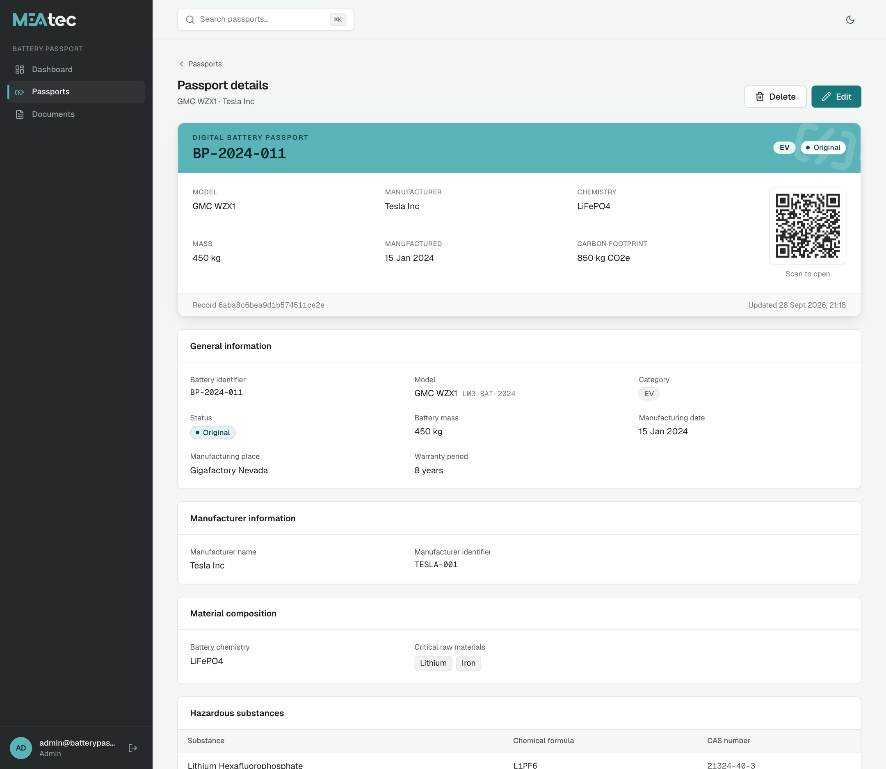

## Live deployment

| What         | URL                                                      |
| ------------ | -------------------------------------------------------- |
| Web app      | https://battery-pass-io.vercel.app                       |
| Auth API     | https://bpp-auth-service.onrender.com/docs               |
| Passport API | https://bpp-passport-service.onrender.com/docs           |
| Document API | https://bpp-document-service.onrender.com/docs           |
| Notification | https://bpp-notification-service.onrender.com/health     |
| Source       | https://github.com/priyanshsen19/BatteryPassportPlatform |

The web app is on Vercel and always up. The four services run on Render's free plan, which puts
them to sleep after 15 minutes without traffic: the first page or API call after a quiet period
can take up to a minute while they start. [docs/testing-guide.md](docs/testing-guide.md) walks
through every flow on the live deployment or locally.

## Contents

1. [Screenshots](#screenshots) (including the [live infrastructure](#live-infrastructure))
2. [Architecture](#architecture)
3. [Services](#services)
4. [Technology stack](#technology-stack)
5. [Repository structure](#repository-structure)
6. [Running locally with Docker Compose](#running-locally-with-docker-compose)
7. [Environment variables](#environment-variables)
8. [AWS S3 configuration](#aws-s3-configuration)
9. [API](#api)
10. [Authentication and RBAC](#authentication-and-rbac)
11. [Kafka topics and payloads](#kafka-topics-and-payloads)
12. [Swagger documentation](#swagger-documentation)
13. [Testing](#testing)
14. [CI](#ci)
15. [Deployment](#deployment)
16. [Design notes](#design-notes)

## Screenshots

Captured from the running Docker Compose stack with sample data.

<table>
  <tr>
    <th>Dashboard</th>
    <th>Dashboard (dark theme)</th>
  </tr>
  <tr>
    <td>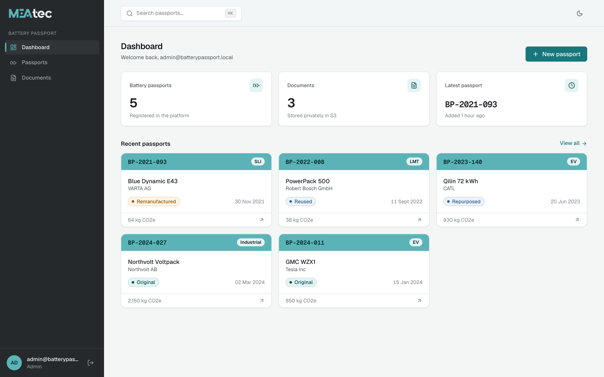</td>
    <td>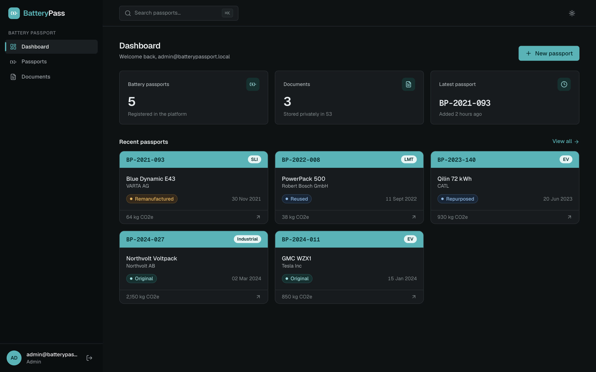</td>
  </tr>
  <tr>
    <th>Passports: search, filters and sorting</th>
    <th>Passports: card view</th>
  </tr>
  <tr>
    <td>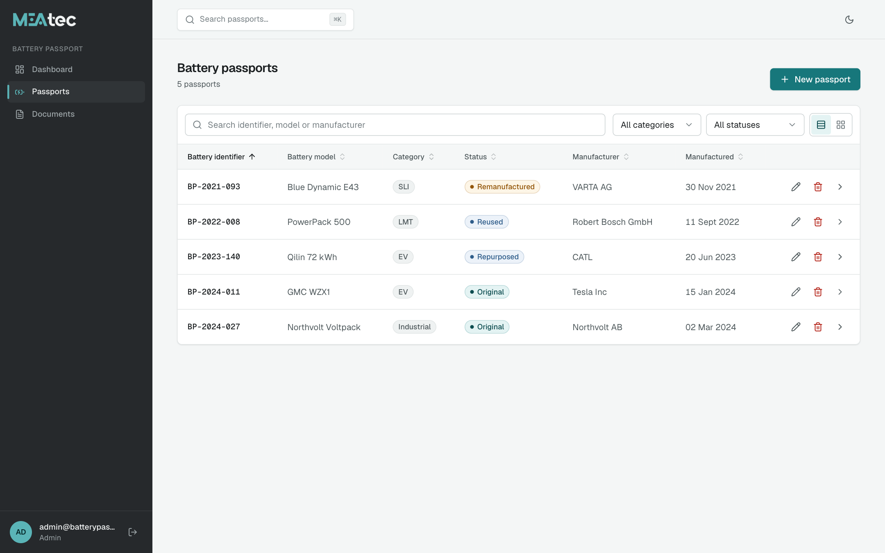</td>
    <td>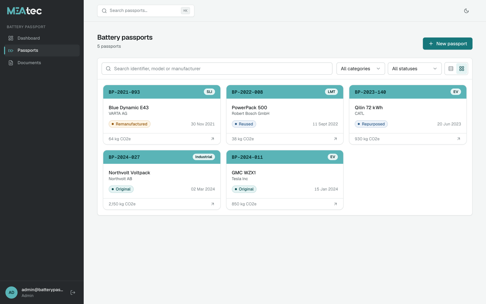</td>
  </tr>
  <tr>
    <th>Passport detail (dark theme)</th>
    <th>Command bar (⌘K)</th>
  </tr>
  <tr>
    <td>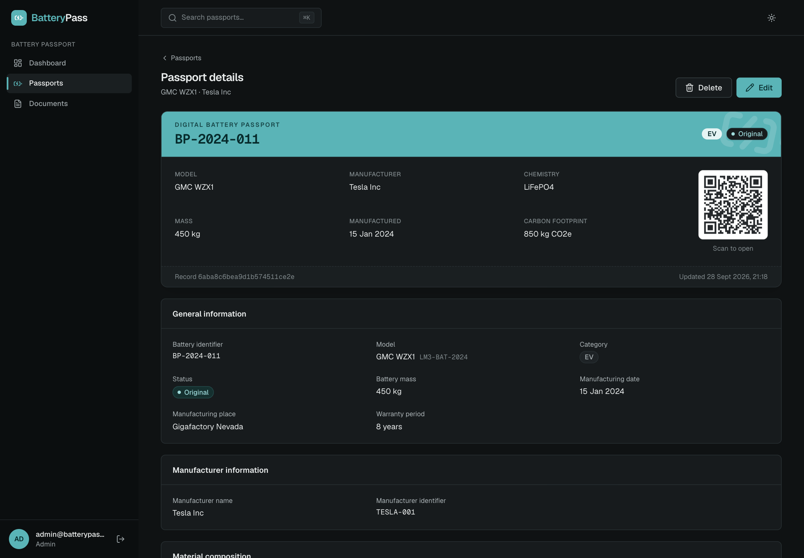</td>
    <td>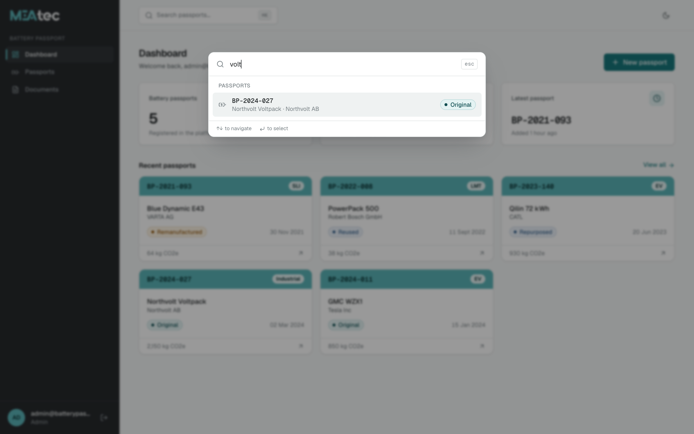</td>
  </tr>
  <tr>
    <th>Documents</th>
    <th>In-app document preview</th>
  </tr>
  <tr>
    <td>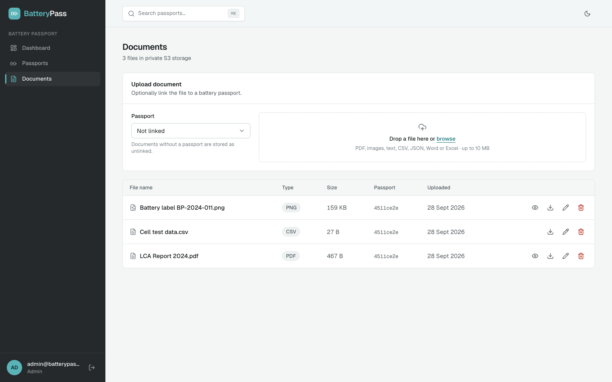</td>
    <td>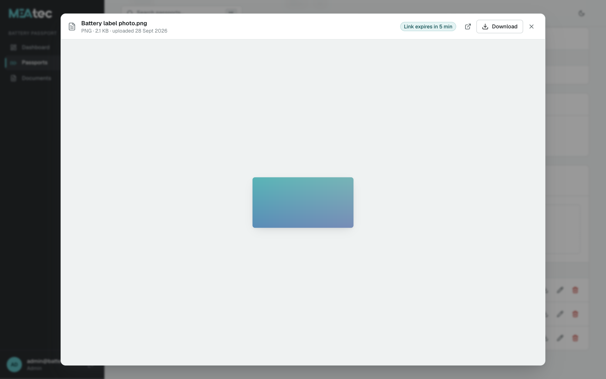</td>
  </tr>
  <tr>
    <th>User roles (admin only)</th>
    <th>Edit passport form</th>
  </tr>
  <tr>
    <td>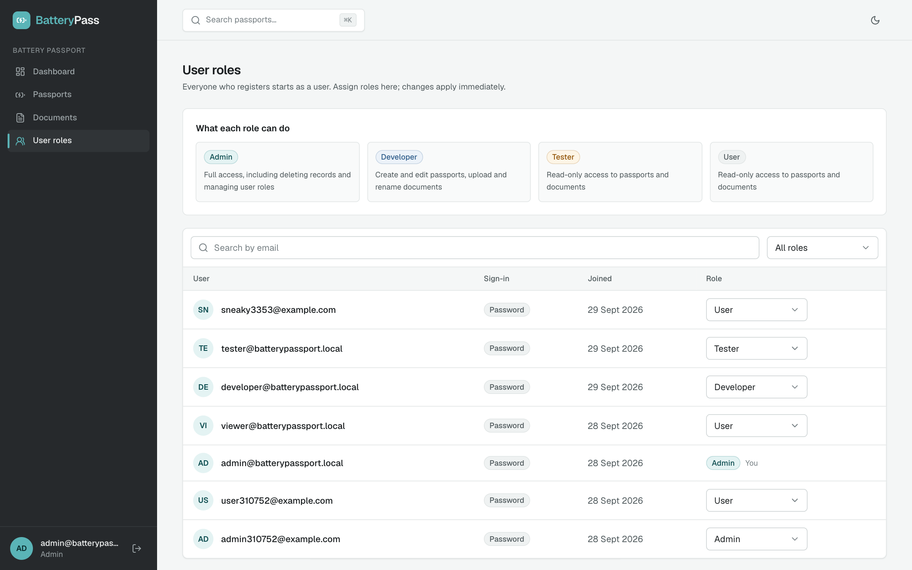</td>
    <td>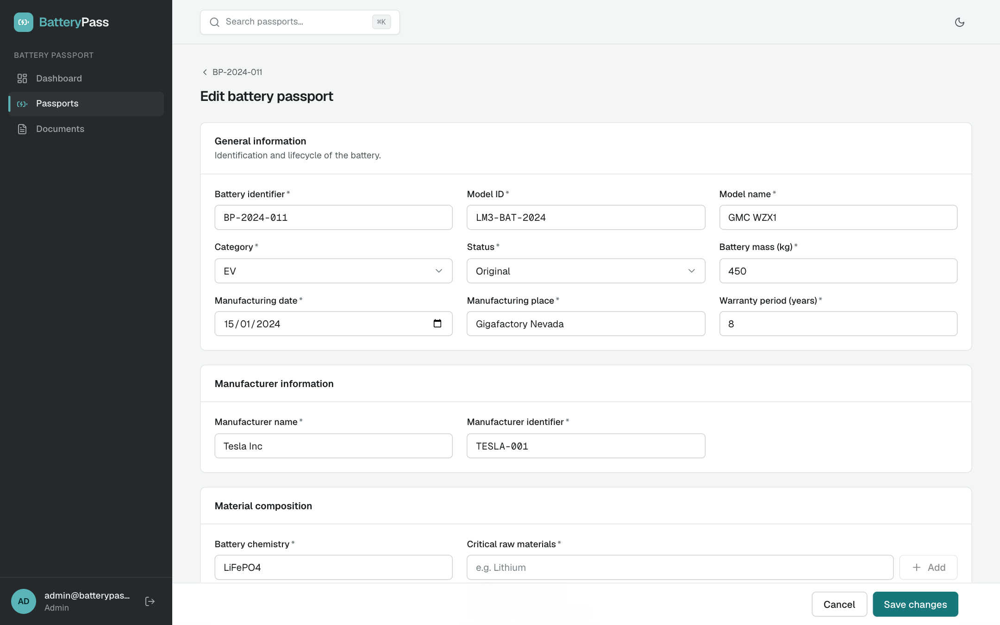</td>
  </tr>
  <tr>
    <th>Sign in</th>
    <th>Mobile</th>
  </tr>
  <tr>
    <td>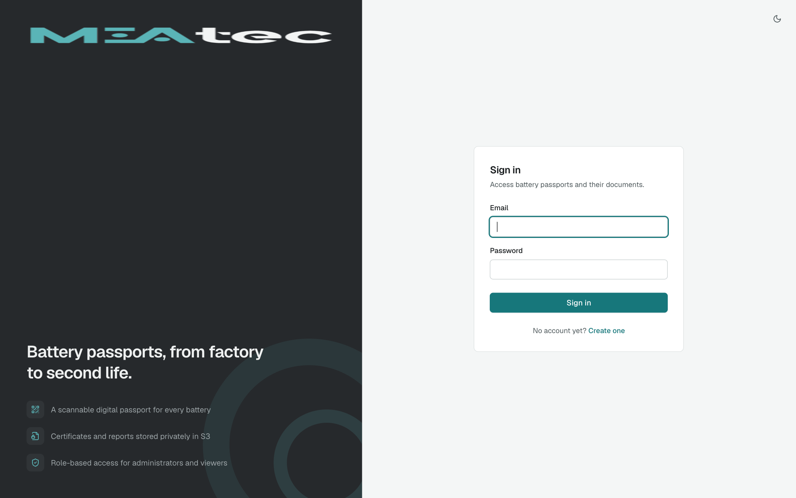</td>
    <td>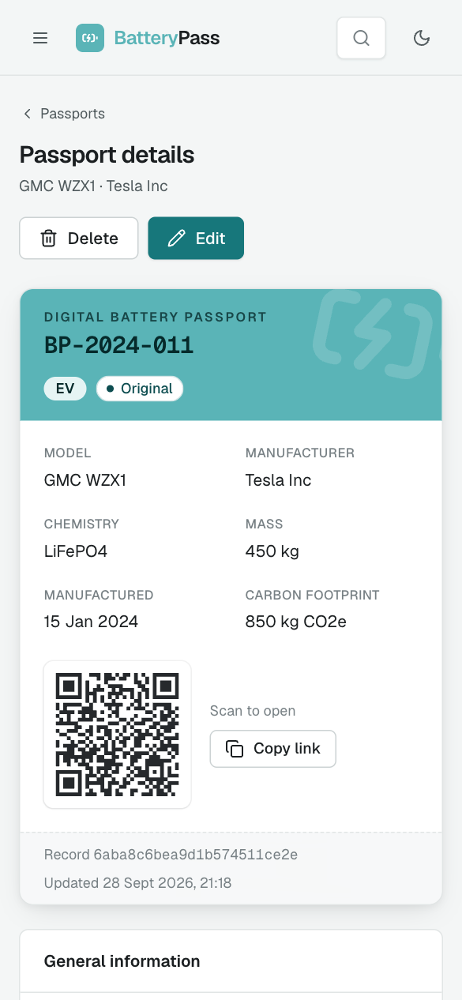</td>
  </tr>
</table>

### Live infrastructure

The hosted deployment uses managed services: MongoDB Atlas (one database per service), AWS S3 for
document files, and Redpanda Cloud for Kafka.

**MongoDB Atlas:** `auth_db`, `passport_db` and `document_db`, each owned by one service.

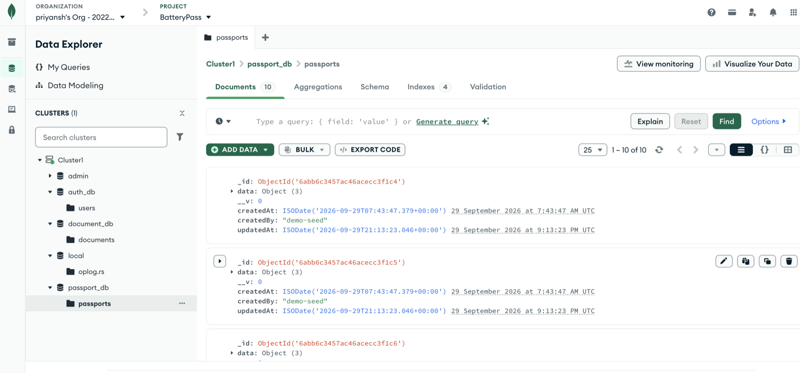

**AWS S3:** a private bucket with objects stored as `documents/{passportId}/{uuid}-{fileName}`.

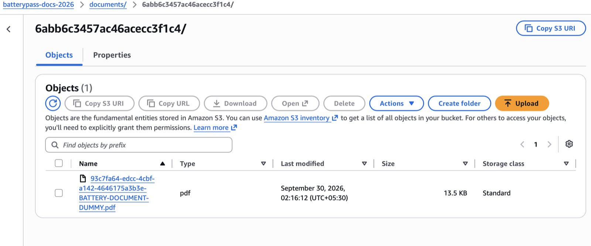

**Kafka (Redpanda):** the `battery-passport-events` topic with `passport.created` and
`passport.updated` events, keyed by passport id.

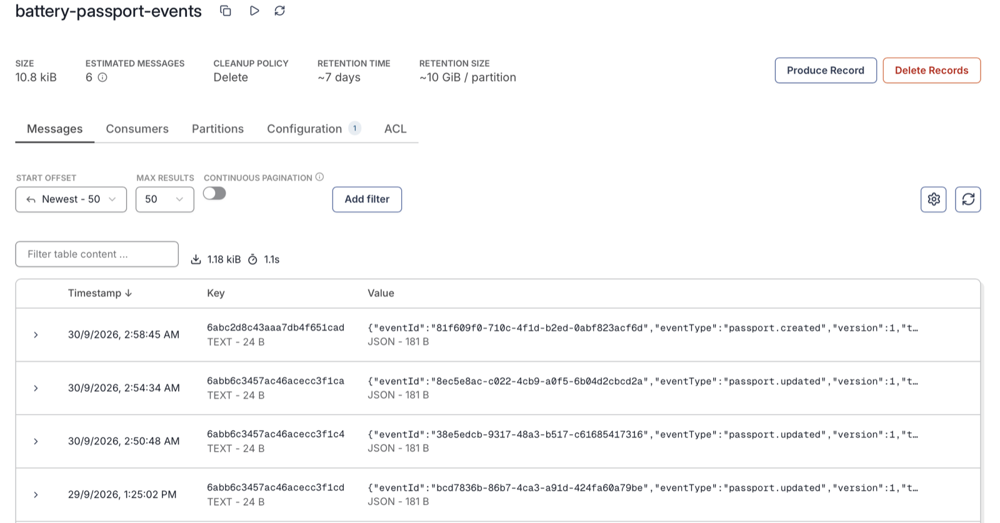

**Email notification:** the notification service consumed the event and emailed it over SMTP
(Brevo's relay, with the Brevo API as a fallback).

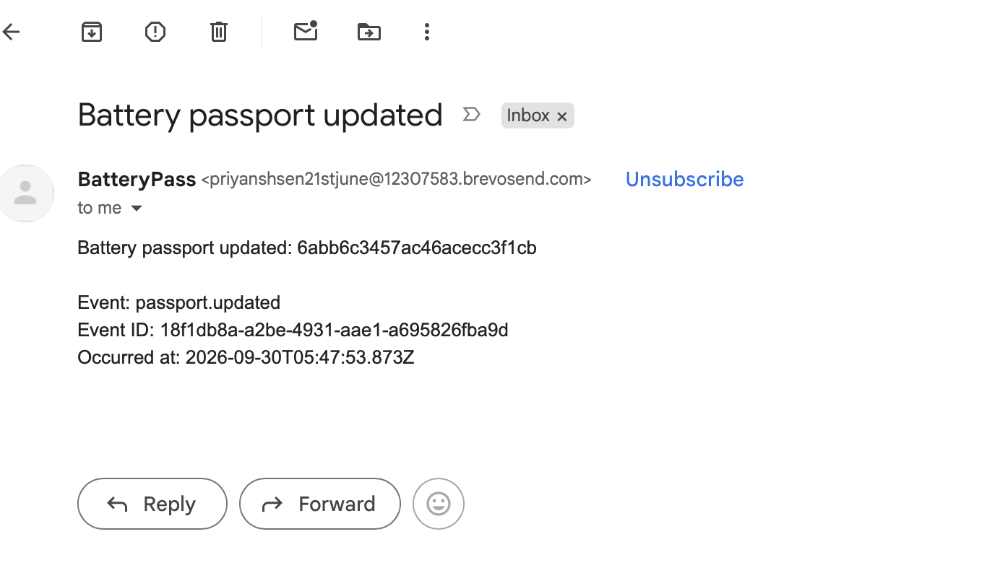

## Architecture

```
Browser ──► web (Next.js :3000)
              │
              ├─HTTP─► auth-service (:4001) ──► auth_db
              │             ▲
              │             │ HTTP GET /api/auth/me (token check on every request)
              │             │
              ├─HTTP─► passport-service (:4002) ──► passport_db
              │             │
              │             └─Kafka topic battery-passport-events─► notification-service (:4004)
              │                                                       ├─► Winston log
              │                                                       └─► SMTP (optional)
              │
              └─HTTP─► document-service (:4003) ──► document_db
                            ├─ HTTP GET /api/passports/:id ─► passport-service
                            └─ AWS SDK v3 ─► S3 (LocalStack locally, AWS in production)
```

- **Synchronous (HTTP):** the passport and document services verify every JWT by calling the
  auth service (`GET /api/auth/me`), using service URLs from environment variables. The document
  service also asks the passport service whether a passport exists before linking a document.
- **Asynchronous (Kafka):** the passport service emits `passport.created`, `passport.updated`
  and `passport.deleted`; the notification service consumes them.
- **Data ownership:** each service has its own MongoDB database that no other service touches.

[docs/architecture.md](docs/architecture.md) has the full design, including failure handling.

## Services

| Service              | Port | Responsibility                                               |
| -------------------- | ---- | ------------------------------------------------------------ |
| auth-service         | 4001 | Registration, login, bcrypt, JWT, roles, password reset      |
| passport-service     | 4002 | Battery passport CRUD, validation, Kafka event publishing    |
| document-service     | 4003 | Multipart upload to S3, metadata in MongoDB, download links  |
| notification-service | 4004 | Kafka consumer; logs and optionally emails (health endpoint) |
| web                  | 3000 | Next.js interface for demonstrating the platform             |

Every service has its own `package.json`, Dockerfile, configuration, tests and `GET /health`.

## Technology stack

- **Backend:** Node.js 22, TypeScript (strict), Express 5, Mongoose 8, KafkaJS, jsonwebtoken,
  bcrypt, AWS SDK v3 (`@aws-sdk/client-s3`, `@aws-sdk/s3-request-presigner`), Multer, Zod,
  Winston, swagger-ui-express, Nodemailer
- **Frontend:** Next.js 15, React 19, Tailwind CSS 4, TanStack Query, React Hook Form, Zod,
  Radix UI, cmdk, next-themes, qrcode.react, Lucide icons, Framer Motion
- **Infrastructure:** MongoDB 7, Apache Kafka 3.8 (KRaft), LocalStack (S3), Docker Compose,
  GitHub Actions
- **Testing:** Jest, Supertest, mongodb-memory-server

## Repository structure

```
.
├── apps/
│   ├── auth-service/            # src/{models,repositories,services,controllers,routes,docs}
│   ├── passport-service/        # + src/events (Kafka producer), src/seed (sample passports)
│   ├── document-service/        # + src/storage (S3), src/clients (passport service)
│   ├── notification-service/    # src/consumer (Kafka), src/notifications (log, email)
│   └── web/                     # Next.js app (src/app, src/components, src/lib)
├── packages/shared/             # Zod schemas, errors, Express app factory, auth middleware,
│                                # Kafka helpers, logging, runtime helpers
├── infrastructure/localstack/   # creates the private bucket in LocalStack
├── scripts/e2e.mjs              # end-to-end check against the Docker Compose stack
├── docs/                        # architecture, testing guide, screenshots
├── .github/workflows/           # CI and the keep-alive job
├── docker-compose.yml
├── render.yaml                  # Render Blueprint for the four services
└── .env.example
```

## Running locally with Docker Compose

Requirements: Docker with Compose v2. Node.js 22 and pnpm are only needed for the tests and helper
scripts (`corepack enable` installs the pinned pnpm version).

1. Create the environment file:

   ```bash
   cp .env.example .env
   ```

2. In `.env`, set:
   - `JWT_SECRET`: at least 32 characters, e.g. from `openssl rand -base64 48`
   - `MONGO_ROOT_PASSWORD`, and the same value in place of `replace-with-a-local-password` in
     the three MongoDB URIs
   - `BOOTSTRAP_ADMIN_EMAIL` and `BOOTSTRAP_ADMIN_PASSWORD`: the first admin account

3. Start everything:

   ```bash
   docker compose up --build -d
   ```

Compose starts MongoDB, Kafka, LocalStack, the four services and the web app. Health checks gate
start-up, and each service retries its own connections, so the stack is ready once every container
shows `healthy` in `docker compose ps` (usually within a minute).

| URL                          | What                                   |
| ---------------------------- | -------------------------------------- |
| http://localhost:3000        | Web interface                          |
| http://localhost:4001/docs   | Auth service Swagger UI                |
| http://localhost:4002/docs   | Passport service Swagger UI            |
| http://localhost:4003/docs   | Document service Swagger UI            |
| http://localhost:4004/health | Notification service health (loopback) |

Sign in with the bootstrap admin from `.env`. The passport service adds ten sample passports at
start-up (`SEED_DEMO_DATA=true`); it only inserts identifiers that are missing, so edits and
deletions are kept.

Optional demo accounts for the other roles:

```bash
corepack enable && pnpm install && pnpm seed
```

| Email                           | Password             | Role      |
| ------------------------------- | -------------------- | --------- |
| developer@batterypassport.local | `DeveloperPassw0rd!` | developer |
| tester@batterypassport.local    | `TesterPassw0rd!`    | tester    |
| viewer@batterypassport.local    | `ViewerPassw0rd!`    | user      |

These credentials are for local demonstration only. Watch notifications arrive with
`docker compose logs -f notification-service`.

### Running a service without Docker

Keep the infrastructure in Docker (`docker compose up -d mongodb kafka localstack`); Kafka is
reachable from the host at `localhost:29092`. Then, per service:

```bash
pnpm install && pnpm build:shared
MONGODB_URI='mongodb://bpp:<password>@localhost:27017/auth_db?authSource=admin' \
JWT_SECRET='<secret>' pnpm --filter auth-service dev
```

For the web app, copy `apps/web/.env.example` to `apps/web/.env.local` and run
`pnpm --filter web dev`.

### Web interface

The BatteryPass web app demonstrates every backend capability:

- **Dashboard:** live counts of passports and documents, and the most recent passports.
- **Passports:** a sortable table or card grid with search and category/status filters; the view
  is kept in the URL so it can be shared.
- **Passport detail:** each battery as a digital passport card with a QR code linking to its page,
  followed by the full passport data and its documents.
- **Documents:** upload with progress, in-app preview for PDFs and images, rename, download and
  delete.
- **User roles:** admins see every user and change their roles.
- **Account:** sign-up as user or admin (with an access code), sign-in, Google sign-in and
  password reset.
- **Command bar:** ⌘K / Ctrl+K searches passports and jumps to any page or action.
- **Light and dark themes**, following the system setting by default.

Actions a role may not perform are hidden in the UI, and the services enforce every permission.

## Environment variables

Every variable is documented in [.env.example](.env.example). Docker Compose maps them onto each
service, and every service validates its own variables with Zod at start-up, refusing to start if
one is missing or invalid.

**All services**

- `NODE_ENV`, `LOG_LEVEL`: runtime mode and Winston log level.
- `CORS_ORIGINS` (auth, passport, document): comma-separated allowed browser origins, or `*`.
- `AUTH_SERVICE_PORT` … `WEB_PORT` (Compose only): host ports.

**Auth service**

- `JWT_SECRET`: HMAC secret, at least 32 characters; only the auth service has it.
- `JWT_EXPIRES_IN`: token lifetime (default `1h`).
- `BCRYPT_SALT_ROUNDS`: bcrypt work factor (default 12).
- `BOOTSTRAP_ADMIN_EMAIL`, `BOOTSTRAP_ADMIN_PASSWORD`: first admin, created or promoted at
  start-up; the password is only used when the account is created.
- `PUBLIC_APP_URL`: web app URL, used in password reset links.
- `PASSWORD_RESET_TTL_MINUTES`: reset link lifetime (default 30).
- `GOOGLE_CLIENT_ID`: optional; Google sign-in is off when empty.
- `ADMIN_ACCESS_CODE`: optional, at least 8 characters; sign-ups with this code become admins.
- `RATE_LIMIT_WINDOW_MINUTES`, `LOGIN_MAX_FAILED_ATTEMPTS`, `PASSWORD_RESET_MAX_REQUESTS`,
  `ACCESS_CODE_MAX_FAILED_ATTEMPTS`: rate limits (defaults 15, 10, 3 and 3).

**Databases**

- `MONGO_ROOT_USERNAME`, `MONGO_ROOT_PASSWORD`: local MongoDB root user.
- `AUTH_MONGODB_URI`, `PASSPORT_MONGODB_URI`, `DOCUMENT_MONGODB_URI`: one database per service,
  passed to each service as `MONGODB_URI`.

**Kafka** (passport, notification)

- `KAFKA_BROKERS`: bootstrap servers.
- `KAFKA_SSL`, `KAFKA_SASL_MECHANISM`, `KAFKA_SASL_USERNAME`, `KAFKA_SASL_PASSWORD`: for hosted
  Kafka.
- `KAFKA_GROUP_ID` (notification): consumer group.
- `SEED_DEMO_DATA` (passport): add the ten sample passports at start-up.

**S3** (document)

- `AWS_REGION`, `AWS_S3_BUCKET`: bucket location; the region must be the bucket's region.
- `AWS_ACCESS_KEY_ID`, `AWS_SECRET_ACCESS_KEY`: optional; the SDK default chain (e.g. an IAM
  role) is used when unset.
- `AWS_S3_ENDPOINT`, `AWS_S3_PUBLIC_ENDPOINT`, `AWS_S3_FORCE_PATH_STYLE`: LocalStack only; leave
  empty for AWS.
- `DOWNLOAD_URL_TTL_SECONDS`: download link lifetime (default 300).

**Service URLs**

- `AUTH_SERVICE_URL` (passport, document, web), `PASSPORT_SERVICE_URL` (document, web),
  `DOCUMENT_SERVICE_URL` (web).
- `NOTIFICATION_SERVICE_URL` (web, optional): pinged on each visit so a sleeping service wakes up.

**Web app**

- `SESSION_COOKIE_SECURE`: `true` when served over HTTPS.
- `PUBLIC_APP_URL`: public URL, used for the Google OAuth redirect URI.
- `GOOGLE_CLIENT_ID`, `GOOGLE_CLIENT_SECRET`: optional Google sign-in.

**Email** (auth for reset links, notification for events; logging only when neither SMTP nor Brevo
is configured)

- `SMTP_HOST`, `SMTP_PORT`, `SMTP_SECURE`, `SMTP_USER`, `SMTP_PASSWORD`: SMTP delivery.
- `BREVO_API_KEY`: optional fallback through Brevo's HTTPS API, used when SMTP is not set or
  fails (some hosts block outbound SMTP).
- `SMTP_FROM`: sender for both (defaults to `SMTP_USER`); with Brevo it must be a verified
  sender address.
- `NOTIFICATION_FILE` (notification): mock email; every notification is also appended to this
  text file (`/tmp/notifications.txt` in Compose).
- `NOTIFICATION_EMAIL_TO` (notification): recipients of event notifications, separated by commas
  (e.g. `ops@example.com, lead@example.com`).

The browser only talks to the Next.js server, which calls the services with the server-side URLs
above, so no `NEXT_PUBLIC_*` variables or secrets reach the browser.

## AWS S3 configuration

Locally, LocalStack emulates S3 and `infrastructure/localstack/init-s3.sh` creates the bucket with
public access blocked. For AWS:

1. **Create a bucket** in your region:

   ```bash
   aws s3api create-bucket --bucket <name> --region eu-central-1 \
     --create-bucket-configuration LocationConstraint=eu-central-1
   ```

2. **Keep it private:** leave _Block all public access_ on, and add no bucket policy granting
   public reads (downloads use pre-signed URLs):

   ```bash
   aws s3api put-public-access-block --bucket <name> --public-access-block-configuration \
     BlockPublicAcls=true,IgnorePublicAcls=true,BlockPublicPolicy=true,RestrictPublicBuckets=true
   ```

3. **Create credentials** limited to that bucket: preferably an IAM role attached to the compute
   running the document service, otherwise an IAM user with an access key and this policy:

   ```json
   {
     "Version": "2012-10-17",
     "Statement": [
       { "Effect": "Allow", "Action": ["s3:ListBucket"], "Resource": "arn:aws:s3:::<name>" },
       {
         "Effect": "Allow",
         "Action": ["s3:PutObject", "s3:GetObject", "s3:DeleteObject"],
         "Resource": "arn:aws:s3:::<name>/documents/*"
       }
     ]
   }
   ```

4. **Configure the document service:** set `AWS_REGION`, `AWS_S3_BUCKET` and, unless using a role,
   `AWS_ACCESS_KEY_ID` / `AWS_SECRET_ACCESS_KEY`. Leave `AWS_S3_ENDPOINT` and
   `AWS_S3_PUBLIC_ENDPOINT` empty and set `AWS_S3_FORCE_PATH_STYLE=false`.
5. **Run** the service. At start-up it checks the bucket with `HeadBucket` and stops with a clear
   message if the bucket is missing, in another region, or not accessible.

Never commit credentials; `.env` files are ignored by Git.

## API

All responses share one envelope:

```json
{ "success": true, "data": {} }
```

```json
{
  "success": false,
  "error": {
    "code": "PASSPORT_NOT_FOUND",
    "message": "Battery passport not found",
    "requestId": "…"
  }
}
```

Validation failures (`422 VALIDATION_ERROR`) include `details: [{ "field", "message" }]`.

### Auth service (`:4001`)

| Method | Path                           | Access  | Body → result                          |
| ------ | ------------------------------ | ------- | -------------------------------------- |
| POST   | `/api/auth/register`           | public  | `{ email, password, accessCode? }`     |
| POST   | `/api/auth/access-code/verify` | public  | `{ accessCode }` → valid or 403        |
| POST   | `/api/auth/login`              | public  | `{ email, password }` → JWT            |
| POST   | `/api/auth/google`             | public  | `{ idToken }` → JWT                    |
| POST   | `/api/auth/forgot-password`    | public  | `{ email }` → emails a reset link      |
| POST   | `/api/auth/reset-password`     | public  | `{ token, password }` → new password   |
| GET    | `/api/auth/me`                 | any JWT | current user (used by other services)  |
| GET    | `/api/auth/users`              | admin   | users with roles (`q`, `role` filters) |
| PATCH  | `/api/auth/users/:id/role`     | admin   | `{ role }` → updated user              |

- Registration creates an `admin` with a valid access code, otherwise a `user` (a wrong code is
  not an error). The assignment's `role` field is accepted but grants nothing on its own.
- Forgot-password gives the same response whether or not the email is registered.
- A password reset signs out every existing session of that user.
- Admins cannot change their own role.

### Passport service (`:4002`)

| Method | Path                 | Roles                    | Result                            |
| ------ | -------------------- | ------------------------ | --------------------------------- |
| POST   | `/api/passports`     | admin, developer, tester | create; emits `passport.created`  |
| GET    | `/api/passports/:id` | all roles                | retrieve                          |
| PUT    | `/api/passports/:id` | admin, developer         | replace; emits `passport.updated` |
| DELETE | `/api/passports/:id` | admin                    | delete; emits `passport.deleted`  |
| GET    | `/api/passports`     | all roles                | paginated list                    |

`GET /api/passports` accepts:

- `page`, `limit`
- `q`: case-insensitive search across battery identifier, model and manufacturer
- `category`, `status`
- `sort`: `createdAt`, `batteryIdentifier`, `modelName`, `batteryCategory`, `batteryStatus`,
  `manufacturerName` or `manufacturingDate`; `order`: `asc` or `desc`

Unknown values are rejected with `422`. Valid categories are `EV`, `LMT`, `Industrial`, `SLI` and
`Portable`; valid statuses are `Original`, `Repurposed`, `Reused`, `Remanufactured` and `Waste`.
Unknown properties in a passport body are rejected.

### Document service (`:4003`)

| Method | Path                    | Roles                    | Result                           |
| ------ | ----------------------- | ------------------------ | -------------------------------- |
| POST   | `/api/documents/upload` | admin, developer, tester | `{ docId, fileName, createdAt }` |
| GET    | `/api/documents/:docId` | all roles                | metadata and download link       |
| PUT    | `/api/documents/:docId` | admin, developer         | update metadata                  |
| DELETE | `/api/documents/:docId` | admin                    | delete file and metadata         |
| GET    | `/api/documents`        | all roles                | list, optional `passportId`      |

- Upload is `multipart/form-data` with `file` and an optional `passportId`.
- Accepted types: PDF, PNG, JPEG, WebP, plain text, CSV, JSON, DOCX and XLSX, up to 10 MB.
- Metadata updates accept `fileName` and `passportId`.
- Download links expire after `DOWNLOAD_URL_TTL_SECONDS` (300 by default).
- `?disposition=inline` returns a link the browser can display (in-app preview); it is honoured
  for PDFs and images only.

### Example session

```bash
# Log in as the bootstrap admin (BOOTSTRAP_ADMIN_EMAIL / BOOTSTRAP_ADMIN_PASSWORD in .env)
TOKEN=$(curl -s -X POST localhost:4001/api/auth/login \
  -H 'content-type: application/json' \
  -d '{"email":"admin@batterypassport.local","password":"<BOOTSTRAP_ADMIN_PASSWORD>"}' \
  | jq -r .data.token)

# Create a passport (the request body from the assignment)
curl -s -X POST localhost:4002/api/passports -H "authorization: Bearer $TOKEN" \
  -H 'content-type: application/json' -d @- <<'JSON'
{
  "data": {
    "generalInformation": {
      "batteryIdentifier": "BP-2024-011",
      "batteryModel": { "id": "LM3-BAT-2024", "modelName": "GMC WZX1" },
      "batteryMass": 450,
      "batteryCategory": "EV",
      "batteryStatus": "Original",
      "manufacturingDate": "2024-01-15",
      "manufacturingPlace": "Gigafactory Nevada",
      "warrantyPeriod": "8",
      "manufacturerInformation": {
        "manufacturerName": "Tesla Inc",
        "manufacturerIdentifier": "TESLA-001"
      }
    },
    "materialComposition": {
      "batteryChemistry": "LiFePO4",
      "criticalRawMaterials": ["Lithium", "Iron"],
      "hazardousSubstances": [
        {
          "substanceName": "Lithium Hexafluorophosphate",
          "chemicalFormula": "LiPF6",
          "casNumber": "21324-40-3"
        }
      ]
    },
    "carbonFootprint": {
      "totalCarbonFootprint": 850,
      "measurementUnit": "kg CO2e",
      "methodology": "Life Cycle Assessment (LCA)"
    }
  }
}
JSON

# Upload a document for it and fetch a download link
curl -s -X POST localhost:4003/api/documents/upload -H "authorization: Bearer $TOKEN" \
  -F file=@report.pdf -F passportId=<passport id>
curl -s localhost:4003/api/documents/<docId> -H "authorization: Bearer $TOKEN"
```

## Authentication and RBAC

- Passwords are hashed with bcrypt (work factor 12 by default) and never returned or logged.
- Login returns an HS256 JWT containing only `sub` (user id), `email` and `role`; issuer, audience
  and expiry (`1h`) are checked on verification.
- `authenticateJWT`, `requireRole(...roles)` and `requirePermission(permission)` live in
  `packages/shared`. The auth service verifies tokens locally; the passport and document services
  verify them over HTTP through the auth service, then check the permission.
- Permissions are defined once in `packages/shared` (`PERMISSIONS`), enforced by every service and
  mirrored by the web UI:

  | Permission                                     | admin | developer | tester | user |
  | ---------------------------------------------- | :---: | :-------: | :----: | :--: |
  | View passports, preview and download documents |   ✓   |     ✓     |   ✓    |  ✓   |
  | Create passports and upload documents          |   ✓   |     ✓     |   ✓    |      |
  | Edit passports and rename documents            |   ✓   |     ✓     |        |      |
  | Delete passports and documents                 |   ✓   |           |        |      |
  | Manage user roles (User roles page)            |   ✓   |           |        |      |

- **Registration** creates a `user`, or an `admin` when a valid admin access code
  (`ADMIN_ACCESS_CODE`, shared by the platform owner) is sent. On the sign-up page, choosing
  **Admin** shows an access-code field; the code is checked first
  (`POST /api/auth/access-code/verify`), so a wrong code shows a warning with the attempts left and
  creates nothing. Through the API, a missing or wrong code simply creates a `user`. The
  assignment's `role` field is accepted but grants nothing on its own, and Google sign-in always
  creates a `user`.
- **Developer and tester** are assigned only by admins.
- **Role changes** are made by admins on the **User roles** page (`PATCH /api/auth/users/:id/role`)
  and apply on the user's next request, because every token is re-checked against the stored role.
  Admins cannot change their own role, so there is always at least one admin.
- **The first admin** comes from configuration: at start-up the auth service creates the
  `BOOTSTRAP_ADMIN_EMAIL` account with `BOOTSTRAP_ADMIN_PASSWORD`, or promotes the account if it
  already exists (its password is never changed).

### Rate limiting

Counters live in the auth service's memory and use a 15-minute window
(`RATE_LIMIT_WINDOW_MINUTES`). A blocked request gets `429 TOO_MANY_REQUESTS` with
"try again in N minutes" and a `Retry-After` header.

| What                     | Limit               | Counted per |
| ------------------------ | ------------------- | ----------- |
| Failed logins            | 10                  | email       |
| Password reset emails    | 3                   | email       |
| Failed password resets   | 10                  | visitor     |
| Wrong admin access codes | 3 (30 for everyone) | visitor     |

Every request from the web app reaches the auth service from the web server, so account limits
are keyed by email, and the web app forwards the visitor's address for the others. The cap across
all visitors keeps the access code from being guessed from many addresses.

### Password reset

1. **Forgot password?** on the sign-in page asks for the account email
   (`POST /api/auth/forgot-password`). The response is the same whether or not the email is
   registered, so it cannot be used to discover accounts.
2. The auth service stores only a SHA-256 hash of a random 256-bit token and emails
   `{PUBLIC_APP_URL}/reset-password?token=…`. The link expires after 30 minutes by default, works
   once, and a newer request replaces an older link.
3. The reset page sets the new password (`POST /api/auth/reset-password`). Tokens issued before
   the change are rejected (`TOKEN_REVOKED`), so every existing session ends. Accounts created
   with Google can use this to add a password.

Emails go through SMTP, falling back to Brevo (`BREVO_API_KEY`) if SMTP fails; the auth service
checks both at start-up and logs the result. With neither configured, the link is written to the
auth-service log instead (`docker compose logs auth-service | grep resetUrl`).

### Google sign-in (optional)

Disabled until OAuth credentials are configured; local start-up never depends on it.

- The web app runs the OAuth 2.0 authorization-code flow with PKCE and a `state` check on its
  server, then sends Google's ID token to `POST /api/auth/google`.
- The auth service verifies the token with `google-auth-library` (signature, issuer, expiry and
  audience), requires a verified email and issues the platform's normal JWT.
- The first sign-in creates a `user`. If the email already belongs to an account, the Google
  identity is linked to it and its role is kept. Accounts created through Google have no password
  until one is set through password reset.

To enable it:

1. In Google Cloud Console, create an OAuth client ID of type **Web application**.
2. Add the authorized redirect URI `http://localhost:3000/api/auth/google/callback` (or
   `<public URL>/api/auth/google/callback` when deployed).
3. Set `GOOGLE_CLIENT_ID`, `GOOGLE_CLIENT_SECRET` and `PUBLIC_APP_URL` in `.env`, then restart
   with `docker compose up -d auth-service web`.

## Kafka topics and payloads

| Topic                     | Producer         | Consumer group       | Key          |
| ------------------------- | ---------------- | -------------------- | ------------ |
| `battery-passport-events` | passport-service | notification-service | `passportId` |

Event types are `passport.created`, `passport.updated` and `passport.deleted`. Every message
carries an `eventType` header and, when available, the originating `x-request-id`.

```json
{
  "eventId": "0b9c5f0e-3f4a-4d0c-9a51-6f1f2f3c1a77",
  "eventType": "passport.created",
  "version": 1,
  "timestamp": "2024-10-05T10:00:00.000Z",
  "data": { "passportId": "6700f1c2a7d4e5f601234567" }
}
```

`passport.updated` and `passport.deleted` use the same shape. The notification service validates
each message against this schema and logs, for example:

```json
{
  "level": "info",
  "service": "notification-service",
  "message": "[Notification] Battery passport created: 6700f1c2a7d4e5f601234567",
  "eventType": "passport.created",
  "eventId": "…",
  "passportId": "…",
  "timestamp": "…"
}
```

As a mock email, every notification is also appended to a text file (`NOTIFICATION_FILE`):

```bash
docker compose exec notification-service cat /tmp/notifications.txt
```

With `NOTIFICATION_EMAIL_TO` and an email provider set, it also emails the notification: through
SMTP (Nodemailer) first and, if that fails, through Brevo's HTTPS API (`BREVO_API_KEY`). An email
failure is logged and does not stop the log notification. `/health` reports `"email"` as `"up"`,
`"error"` (the log says why) or `"disabled"`, with `"emailProvider"` naming the provider that sent
the latest email. SMTP attempts time out after seconds, so an unreachable mail server never holds
up the events behind it.

## Swagger documentation

Each HTTP service serves Swagger UI at `/docs` and the OpenAPI document at `/docs.json`, with
request bodies, required roles, example responses and error responses:
[auth](http://localhost:4001/docs), [passport](http://localhost:4002/docs),
[document](http://localhost:4003/docs).

## Testing

```bash
pnpm install
pnpm test
```

Unit and integration tests use Jest and Supertest against in-memory MongoDB
(mongodb-memory-server); Kafka, S3 and cross-service HTTP calls are replaced by fakes at their
interfaces.

- **auth:** registration (with and without a role), duplicate email, validation, login, JWT claims
  and verification, forged and stale tokens, role middleware, user-role management, Google
  sign-in, bootstrap admin, password reset (expiry, single use, session revocation).
- **passport:** CRUD, permissions for every role, 400/404/409/422 cases, event emission and
  payload, Kafka failure handling, producer topic/key/payload, sample-data seeding.
- **document:** upload with metadata, object key format, type and size limits, unknown passport,
  S3 failures, pre-signed URLs, metadata update, delete (including partial failure), permissions
  for every role, bucket checks at start-up, file-name sanitising.
- **notification:** all three event types, invalid messages, duplicates, log and email channels,
  channel failure isolation, health.

End-to-end check against the running Docker Compose stack (about 90 checks: every role on every
endpoint, S3 upload/download/delete, Kafka notifications, password reset, the web app's session):

```bash
docker compose up -d --build
pnpm test:e2e
```

[docs/testing-guide.md](docs/testing-guide.md) walks through every flow by hand, in the web app
and with curl. Other checks: `pnpm lint`, `pnpm typecheck`, `pnpm format:check`, `pnpm build`.

## CI

`.github/workflows/ci.yml` runs on every push to `main` and every pull request: install (frozen
lockfile), format check, lint, typecheck, tests and build, then builds every Docker image. Any
failing step fails the workflow.

## Deployment

Each service is an independent container image, built from the repository root, e.g.
`docker build -f apps/passport-service/Dockerfile .`.

- **Backend services:** Render (Docker web services), or any container platform.
- **Web app:** Vercel; the Docker image also runs on any container host.
- **MongoDB:** MongoDB Atlas, one database per service.
- **Object storage:** AWS S3 (see [AWS S3 configuration](#aws-s3-configuration)).
- **Kafka:** a hosted Kafka-compatible provider, with `KAFKA_SSL=true` and the `KAFKA_SASL_*`
  variables.

In production set `NODE_ENV=production`, a strong `JWT_SECRET`, `CORS_ORIGINS` and, behind HTTPS,
`SESSION_COOKIE_SECURE=true`. Local Docker Compose does not depend on any deployment setting.

### Backend services on Render

[`render.yaml`](render.yaml) is a Render Blueprint that creates `bpp-auth-service`,
`bpp-passport-service`, `bpp-document-service` and `bpp-notification-service` as Docker web
services, with health checks and a generated `JWT_SECRET`.

1. **Prepare the external services:**
   - MongoDB Atlas, with a URI for each of `auth_db`, `passport_db` and `document_db`
     (allow access from Render)
   - an AWS S3 bucket and IAM credentials
   - a hosted Kafka cluster: bootstrap server, SASL username, password and mechanism
2. **Create the Blueprint:** in Render choose **New → Blueprint**, select this repository and
   apply. Render asks for every value marked `sync: false`.
3. **Connect the services** once Render shows their URLs:

   | Service                  | Variable               | Value                         |
   | ------------------------ | ---------------------- | ----------------------------- |
   | passport, document       | `AUTH_SERVICE_URL`     | URL of `bpp-auth-service`     |
   | document                 | `PASSPORT_SERVICE_URL` | URL of `bpp-passport-service` |
   | auth                     | `PUBLIC_APP_URL`       | URL of the web app            |
   | auth, passport, document | `CORS_ORIGINS`         | URL of the web app            |

4. **Redeploy** the affected services.

### Web app on Vercel

[`apps/web/vercel.json`](apps/web/vercel.json) installs and builds the web app together with the
shared package from the monorepo root.

1. In Vercel choose **Add New → Project** and import this repository.
2. Set **Root Directory** to `apps/web`.
3. Add the environment variables:

   | Variable                       | Value                                           |
   | ------------------------------ | ----------------------------------------------- |
   | `AUTH_SERVICE_URL`             | `https://bpp-auth-service.onrender.com`         |
   | `PASSPORT_SERVICE_URL`         | `https://bpp-passport-service.onrender.com`     |
   | `DOCUMENT_SERVICE_URL`         | `https://bpp-document-service.onrender.com`     |
   | `NOTIFICATION_SERVICE_URL`     | `https://bpp-notification-service.onrender.com` |
   | `PUBLIC_APP_URL`               | the Vercel URL                                  |
   | `SESSION_COOKIE_SECURE`        | `true`                                          |
   | `GOOGLE_CLIENT_ID`             | optional, for Google sign-in                    |
   | `GOOGLE_CLIENT_SECRET`         | optional, for Google sign-in                    |
   | `ENABLE_EXPERIMENTAL_COREPACK` | `1`                                             |

4. **Deploy.** Then set `PUBLIC_APP_URL` on `bpp-auth-service` and `CORS_ORIGINS` on the auth,
   passport and document services to the Vercel URL. For Google sign-in, add
   `https://<Vercel URL>/api/auth/google/callback` as an authorized redirect URI.

### Sleeping services

- Vercel does not put the web app to sleep. The Render backends use the free instance type and
  sleep after 15 minutes without traffic.
- Every page of the web app pings the backends (at most once a minute). While a service starts,
  Render answers with an HTML 502 page; the web app recognises it (the services always answer
  with JSON) and waits for up to 50 seconds instead of showing an error.
- Free instance hours (750 a month per workspace) are therefore only used while people use the
  platform.
- The notification service consumes Kafka only while awake; after waking it processes the events
  it missed from its committed offset.
- **Keep-alive window.** `.github/workflows/keep-alive.yml` pings every backend every 5 minutes
  until the time in the repository variable `KEEP_ALIVE_UNTIL`, so the services stay awake during
  a review or demo without spending free hours the rest of the month. **Actions → Keep alive → Run
  workflow** wakes every backend once at any time.
- Render re-applies fixed `value:` entries from `render.yaml` on every Blueprint sync, so
  account-specific settings (`AWS_REGION`, `KAFKA_SSL`, `KAFKA_SASL_MECHANISM`, …) are
  `sync: false` and keep their dashboard values.

## Design notes

- **Passport schema.** The request body follows the assignment exactly, including
  `manufacturerInformation` inside `generalInformation`. `manufacturingDate` is stored as a MongoDB
  date and returned in its original `YYYY-MM-DD` form.
- **PUT semantics.** `PUT /api/passports/:id` takes the same full body as create and replaces the
  passport data.
- **Roles beyond the assignment.** The assignment names `admin` and `user`; `developer` and
  `tester` were added for finer access and are only assigned by admins. For `admin` and `user`,
  access matches the assignment: admins write, users read.
- **Admin sign-up.** The assignment's register body lets a client choose its role, which would
  let anyone become an admin. Here admin sign-up needs an access code instead, compared in
  constant time and rate limited.
- **Event delivery.** Events are published after the database write. A broker failure is logged
  with the full event context but does not roll back the change; a transactional outbox would
  guarantee delivery in production.
- **Download links.** Pre-signed S3 URLs are bearer links: anyone holding one can download the
  file until it expires, so they are short-lived (5 minutes by default, `DOWNLOAD_URL_TTL_SECONDS`).
  The web app requests a new link whenever a file is opened or downloaded (reusing one for at
  most a minute), so a user never sees an expired link.
- **LocalStack.** The community edition does not enforce S3 access policies, so unsigned requests
  succeed locally even though public access is blocked. On AWS the bucket settings apply.
